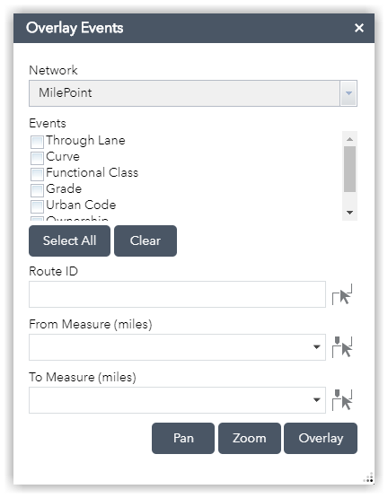

# Overlay Events widget
The Overlay Events widget for Web AppBuilder works with the Esri Roads and Highways and ArcGIS Pipeline Referencing extensions for ArcGIS Enterprise.

This is a developer sample.

The Overlay Events widget allows you to dynamically segment events together into one feature layer. Users can dynamically segment a whole route or just a section of a route when measures are provided. Users can type in route and measure values or use the map to select a route and measures.

## Sections

* [Features](#features)
* [Requirements](#requirements)
* [Instructions](#instructions)
* [Resources](#resources)
* [Issues](#issues)
* [Contributing](#contributing)
* [Licensing](#licensing)

## Features

* Automatically detect a linear referencing enabled map service in the webmap
* Dynamically segment events on a route

## Requirements

* Web AppBuilder for ArcGIS version 2.6
* An LRS enabled map service published with a definition query for time

## Instructions
Deploying Widgets

To use the widget with Web AppBuilder, you should copy the OverlayEvents folder to the stemapp/widgets directory. This is located in %webappbuilder_install%/client directory.

For more resources on developing or modifying widgets please visit
[Web AppBuilder for ArcGIS Documentation](http://doc.arcgis.com/en/web-appbuilder/)

Add a linear referencing enabled map service to the webmap to enable the widget. The LRS map service should be published with a definition query for time.

When configuring the widget, leave 'Measure Precision' blank to use the measure precision configured for the network.

### General Help
[New to Github? Get started here.](http://htmlpreview.github.com/?https://github.com/Esri/esri.github.com/blob/master/help/esri-getting-to-know-github.html)

## Resources

* [Web AppBuilder API](https://developers.arcgis.com/web-appbuilder/api-reference/css-framework.htm)
* [ArcGIS API for JavaScript](https://developers.arcgis.com/javascript/)
* Learn more about [Esri Roads and Highways for Server](https://server.arcgis.com/en/roads-highways/)
* Learn more about [ArcGIS Pipeline Referencing for Server](https://server.arcgis.com/en/pipeline-referencing/)

## Issues

* Find a bug or want to request a new feature?  Please let us know by submitting an issue.

## Contributing

Esri welcomes contributions from anyone and everyone.  Please see our [guidelines for contributing](https://github.com/esri/contributing).

## Licensing

Copyright 2017 Esri

Licensed under the Apache License, Version 2.0 (the "License");
you may not use this file except in compliance with the License.
You may obtain a copy of the License at

   http://www.apache.org/licenses/LICENSE-2.0

Unless required by applicable law or agreed to in writing, software
distributed under the License is distributed on an "AS IS" BASIS,
WITHOUT WARRANTIES OR CONDITIONS OF ANY KIND, either express or implied.
See the License for the specific language governing permissions and
limitations under the License.

A copy of the license is available in the repository's [LICENSE.txt](https://github.com/ArcGIS/lrs-webappbuilder-widgets/blob/master/LICENSE.txt?raw=true) file.